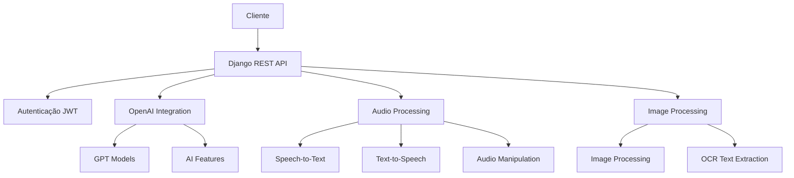

# 📚 Documentação das Dependências do Projeto

> Este documento descreve todas as bibliotecas Python utilizadas no projeto e suas respectivas funcionalidades.

## 📋 Índice

- [🔧 Framework Web](#-framework-web)
- [🔐 Autenticação & Segurança](#-autenticação--segurança)
- [🤖 Inteligência Artificial](#-inteligência-artificial)
- [🎵 Processamento de Áudio](#-processamento-de-áudio)
- [🖼️ Processamento de Imagens](#️-processamento-de-imagens)
- [🌐 Comunicação HTTP](#-comunicação-http)
- [✅ Validação & Tipagem](#-validação--tipagem)
- [🚀 Servidor & Deploy](#-servidor--deploy)
- [🛠️ Utilitários](#️-utilitários)

---

## 🔧 Framework Web

### Django Stack

| Biblioteca | Versão | Descrição |
|------------|--------|-----------|
| **Django** | `5.2.3` | 🎯 Framework web full-stack para desenvolvimento rápido de aplicações robustas |
| **djangorestframework** | `3.16.0` | 🔌 Toolkit para construção de APIs REST com serializers e views |
| **django-cors-headers** | `4.7.0` | 🌍 Middleware para handling de CORS (Cross-Origin Resource Sharing) |
| **asgiref** | `3.8.1` | ⚡ Referência ASGI para suporte assíncrono no Django |
| **sqlparse** | `0.5.3` | 📊 Parser SQL usado internamente pelo Django |

---

## 🔐 Autenticação & Segurança

| Biblioteca | Versão | Descrição |
|------------|--------|-----------|
| **djangorestframework_simplejwt** | `5.5.0` | 🎫 Implementação JWT para Django REST Framework |
| **PyJWT** | `2.9.0` | 🔑 Codificação e decodificação de tokens JWT |

---

## 🤖 Inteligência Artificial

| Biblioteca | Versão | Descrição |
|------------|--------|-----------|
| **openai** | `1.88.0` | 🧠 SDK oficial para integração com APIs da OpenAI (GPT, DALL-E) |

---

## 🎵 Processamento de Áudio

| Biblioteca | Versão | Descrição |
|------------|--------|-----------|
| **gTTS** | `2.5.4` | 🗣️ Google Text-to-Speech para conversão de texto em áudio |
| **PyAudio** | `0.2.14` | 🎤 Reprodução e gravação de áudio (wrapper PortAudio) |
| **pydub** | `0.25.1` | 🎶 Manipulação de arquivos de áudio (cortar, concatenar, converter) |
| **SpeechRecognition** | `3.14.3` | 👂 Reconhecimento de fala com múltiplos engines |

---

## 🖼️ Processamento de Imagens

| Biblioteca | Versão | Descrição |
|------------|--------|-----------|
| **pillow** | `11.2.1` | 🎨 Manipulação e processamento de imagens (fork do PIL) |
| **pytesseract** | `0.3.13` | 📝 OCR - Extração de texto de imagens usando Tesseract |

---

## 🌐 Comunicação HTTP

| Biblioteca | Versão | Descrição |
|------------|--------|-----------|
| **requests** | `2.32.4` | 🌍 Biblioteca elegante para requisições HTTP |
| **httpx** | `0.28.1` | ⚡ Cliente HTTP moderno com suporte assíncrono |
| **httpcore** | `1.0.9` | 🔧 Núcleo HTTP de baixo nível para httpx |
| **h11** | `0.16.0` | 🔗 Implementação pura Python do protocolo HTTP/1.1 |
| **urllib3** | `2.4.0` | 🔒 Cliente HTTP robusto com pool de conexões e SSL/TLS |
| **certifi** | `2025.6.15` | 🛡️ Certificados SSL/TLS root confiáveis |
| **charset-normalizer** | `3.4.2` | 🔤 Detecção automática de codificação de caracteres |
| **idna** | `3.10` | 🌐 Suporte para nomes de domínio internacionalizados |

---

## ✅ Validação & Tipagem

| Biblioteca | Versão | Descrição |
|------------|--------|-----------|
| **pydantic** | `2.11.7` | ✨ Framework para validação de dados usando type hints |
| **pydantic_core** | `2.33.2` | ⚡ Núcleo do Pydantic escrito em Rust (performance) |
| **annotated-types** | `0.7.0` | 📝 Tipos anotados para validação robusta |
| **typing-inspection** | `0.4.1` | 🔍 Inspeção de tipos em tempo de execução |
| **typing_extensions** | `4.14.0` | 🆕 Type hints mais recentes para versões antigas do Python |

---

## 🚀 Servidor & Deploy

| Biblioteca | Versão | Descrição |
|------------|--------|-----------|
| **gunicorn** | `23.0.0` | 🌟 Servidor HTTP WSGI para deploy em produção |

---

## 🛠️ Utilitários

### Configuração & Sistema
| Biblioteca | Versão | Descrição |
|------------|--------|-----------|
| **python-decouple** | `3.8` | ⚙️ Separação de configurações do código (env vars) |
| **python-magic** | `0.4.27` | 🎭 Identificação de tipos de arquivo por conteúdo |
| **distro** | `1.9.0` | 🐧 Informações sobre distribuição Linux |
| **packaging** | `25.0` | 📦 Utilitários para versões e metadados de pacotes |

### Interface & Progresso
| Biblioteca | Versão | Descrição |
|------------|--------|-----------|
| **click** | `8.1.8` | 🖱️ Framework para interfaces de linha de comando |
| **tqdm** | `4.67.1` | 📊 Barras de progresso elegantes |

### Programação Assíncrona
| Biblioteca | Versão | Descrição |
|------------|--------|-----------|
| **anyio** | `4.9.0` | 🔄 Compatibilidade assíncrona (asyncio/trio) |
| **sniffio** | `1.3.1` | 👃 Detecção de biblioteca assíncrona em uso |

### Performance
| Biblioteca | Versão | Descrição |
|------------|--------|-----------|
| **jiter** | `0.10.0` | ⚡ Parser JSON ultra-rápido escrito em Rust |

---

## 🏗️ Arquitetura do Projeto

Com base nas dependências, este projeto implementa:



## 📝 Casos de Uso Identificados

- 🎯 **API REST** com Django REST Framework
- 🔐 **Autenticação JWT** para segurança
- 🤖 **Integração com IA** via OpenAI
- 🎵 **Processamento de Áudio** (STT/TTS)
- 🖼️ **Processamento de Imagens** e OCR
- 🌐 **Comunicação HTTP** robusta
- ✅ **Validação de Dados** com Pydantic
- 🚀 **Deploy** pronto para produção

---

## 🔧 Como Instalar

```bash
# Instalar todas as dependências
pip install -r requirements.txt

# Ou usando pipenv
pipenv install -r requirements.txt

# Ou usando poetry
poetry add $(cat requirements.txt)
```

---

## 📄 Licenças

Todas as bibliotecas listadas são open-source e compatíveis para uso em projetos comerciais. Verifique as licenças específicas de cada biblioteca para mais detalhes.

---

<div align="center">

**💡 Dica**: Este documento é atualizado automaticamente. Para mudanças nas dependências, atualize o `requirements.txt` e esta documentação.

</div>